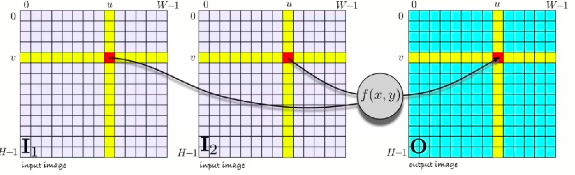

<link rel="stylesheet" href="css/theme/beige.css" id="theme">


---

#Histogram

---

<section data-background="screenshots/m3.png"></section>


---

<section data-background="screenshots/m4.png"></section>

---

<section data-background="screenshots/m4x.png"></section>

---

<section data-background="screenshots/m5.png"></section>

---

<section data-background="screenshots/m5x.png"></section>

---

<section><section/>
<h2><span style="color:rgb(220,54,54);">Live histogram </span> from camera</h2>


---

<section><section/>
<h2><span style="color:rgb(220,54,54);">Live histogram </span> from camera</h2>

---

#Monadic Operations

---

<h2 style="text-align:left;"><span style="color:rgb(220,54,54);">Monadic</span> processing </h2>

<ul>
<li> Each output pixel is a function of corresponding input pixel.</li>
<li> The function is <span style="color:rgb(220,54,54)">the same</span> for all pixels.</li>
</ul>

---

<h2 style="text-align:left;"><span style="color:rgb(220,54,54);">Monadic</span> image processing </h2>
<section></section>

---

<h2 style="text-align:left;"><span style="color:rgb(220,54,54);">Monadic</span> image processing </h2>
<section></section>


---

<h2><span style="color:rgb(220,54,54)">Monodic image</span> processing</h2>
<ul><li><span style="color:rgb(220,54,54)">what is f(x)?</span>
<ul>
<li class="fragment">changing the datatype</li>
<li class="fragment">changing the brightness and contrast</li>
<li class="fragment">histogram normalisation</li>
<li  class="fragment">threshloding</li>
<li class="fragment">posterisation</li>
</ul></li></ul>

---

<section data-background="screenshots/o9.png"></section>

---

<h2><span style="color:rgb(220,54,54)">Changing</span> brightness</h2>


---

<h2><span style="color:rgb(220,54,54)">Code </span>for brightness</h2>

```
import cv2
#bright image
def bright(img,n):
	cc,rr,dd =img.shape
	n=input(" enter no. in range 0-255 ")
	imgB=img+n
	for a in range(cc):
		for b in range(rr):
				if (imgB[a][b][0]<n or imgB[a][b][1]<n or
                                   imgB[a][b][2]<n ):
					imgB[a][b]=255
	return imgB

```


---

<h2><span style="color:rgb(220,54,54)">Changing</span> contrast</h2>


---

<h2><span style="color:rgb(220,54,54)">Code </span>for contrast</h2>
```
#contrasting image.
def contrast(img,n):
	img=img.astype('float32')
	imgB=img*n
	for a in range(cc):
		for b in range(rr):
			if(imgB[a][b][0]>255 or imgB[a][b][1]>255 or 
			imgB[a][b][2]>255):			
				imgB[a][b]=255
	return imgB
```

---

<h2><span style="color:rgb(220,54,54)">negative</span> image</h2>


---

<h2><span style="color:rgb(220,54,54)">Code </span>for negative</h2>

```
#negative image
def negative(img):
	imgB=1-img
	cv2.imwrite('negative.png',imgB)

```

---

<h2><span style="color:rgb(220,54,54)">Posterisation</span></h2>


---

<h2><span style="color:rgb(220,54,54)">Code </span>for posterisation</h2>

```
#posterisation image
import math
def posterisation(img):
	n=int(input('posterisation level'))
	imgB=n*math.floor(img/n)
	imgB=imgB.astype('uint8')
	return imgB

```

---

#Histogram Normalisation

---

<section data-background="screenshots/p6.png"></section>

---

<section data-background="screenshots/p7.png"></section>

---

<section data-background="screenshots/p8.png"></section>

---

<section data-background="screenshots/q2.png"></section>

---

#Gamma Correction

---

<section data-background="screenshots/q5.png"></section>

---

<section data-background="screenshots/q6.png"></section>

---

<section data-background="screenshots/q7.png"></section>

---

<section data-background="screenshots/q8.png"></section>

---

<section data-background="screenshots/q9.png"></section>

---

<section data-background="screenshots/r1.png"></section>

---

#Vectorisation

---

<h2><span style="color:rgb(220,54,54)">Matrix</span> Operations</h2>
<section></section>

---

<h2><span style="color:rgb(220,54,54)">Matrix</span> Operations</h2>
<section></section>

---

#Thresholding

---

<h2><span style="color:rgb(220,54,54)">Thresholding</span> </h2>
<ul>
<li><span style="color:rgb(220,54,54)">The resulting image has only two values:</span>
<ul>
<li class="fragment">false (black) if x<T</li>
<li class="fragment">true (white) if x>=T </li>
</ul></li></ul>


---

#Diadic Operations

---

<h2><span style="color:rgb(220,54,54)">diadic</span> operation</h2>

<ul>
<li> Each output pixel is a function of corresponding input pixel.</li>
<li> The function is <span style="color:rgb(220,54,54)">the same</span> for all pixels.</li>
</ul>

---

<h2><span style="color:rgb(220,54,54)">diadic</span> image processing</h2>
<ul>
<li><span style="color:rgb(220,54,54)">What is f(x,y)?</span>
<ul>
<li class="fragment">Arithmatic
<ul>
<li class="fragment"> x+y </li>
<li class="fragment"> x-y </li>
<li class="fragment"> x*y </li>
<li class="fragment"> etc.</li></li>
</ul></li></ul>


---

<h2><span style="color:rgb(220,54,54)">green screen</span> effects</h2>


---

<h2><span style="color:rgb(220,54,54)">green screen</span> effects</h2>


---

<h2><span style="color:rgb(220,54,54)">green screen</span> effects</h2>


---

<h2><span style="color:rgb(220,54,54)">green screen</span> effects</h2>


---

<h2><span style="color:rgb(220,54,54)">green screen</span> effects</h2>


---

<h2><span style="color:rgb(220,54,54)">green screen</span> effects</h2>


---

<h2><span style="color:rgb(220,54,54)">green screen</span> effects</h2>


